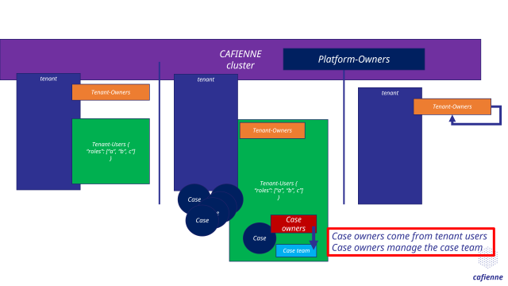

# Cafienne Authorization Overview

## Introduction
This page gives a high level explanation in pictures of the Cafienne multitenancy and authorization.
Please note that it paints both `as-is` and `to-be` scenarios. For a detailed description please read [Cafienne Authorization](cafienne-authorization.md)

-------------------------------------------------------------------------------

-------------------------------------------------------------------------------

-------------------------------------------------------------------------------

-------------------------------------------------------------------------------

-------------------------------------------------------------------------------

-------------------------------------------------------------------------------

-------------------------------------------------------------------------------

-------------------------------------------------------------------------------

